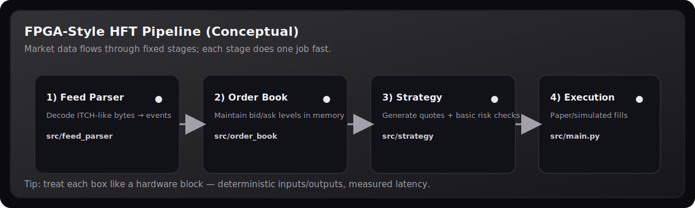
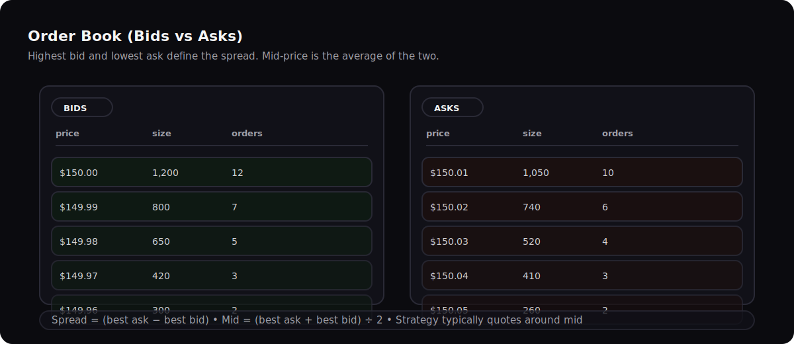
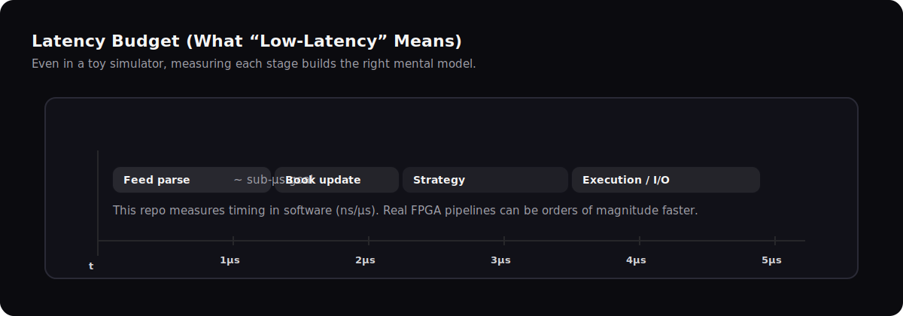
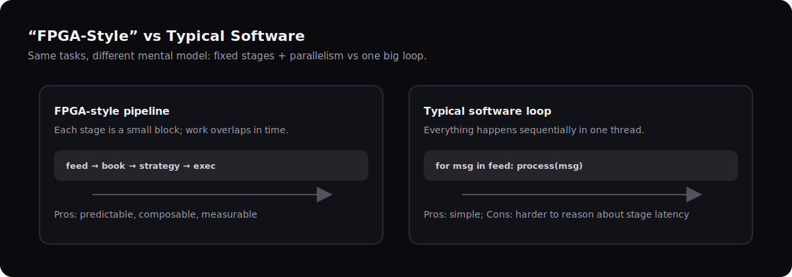

# FPGA-Based HFT System (Software Simulation)

An educational project that explains **high‑frequency trading (HFT)** concepts using an **FPGA‑style pipeline** (fixed stages, measurable latency), built in **Python** with a small **web demo**.

| What this is | What this is not |
|---|---|
| A learning simulator + visualization | A production trading system |
| A “think like hardware” pipeline model | A complete broker/exchange integration |
| A safe place to measure/optimize stages | Financial advice |

<p align="center">
  
</p>

## 🎯 Goal

Build an HFT system that *thinks like an FPGA* without requiring actual hardware. Learn:
- Market data feed parsing at line rate
- Order book management
- Low-latency trading strategies
- Pipeline architecture (FPGA-style parallelism)
- Latency measurement and optimization

## 🧩 The Big Idea (Layman View)

HFT is basically a fast decision loop:

1. **Read** what the market is doing (prices/orders/trades)
2. **Update** your internal “picture” of supply/demand (order book)
3. **Decide** what to do (strategy)
4. **Act** (send an order / simulate one)

This repo models those as *separate pipeline stages* so you can reason about latency like hardware.

## 🏗️ Architecture (Text)

```
┌─────────────────┐
│  Market Data    │ ← Simulated exchange feed (ITCH/OUCH protocol)
│  Feed Parser    │
└────────┬────────┘
         │
         ▼
┌─────────────────┐
│   Order Book    │ ← Maintains bid/ask queues in memory
│   Manager       │
└────────┬────────┘
         │
         ▼
┌─────────────────┐
│  Trading Logic  │ ← Strategy engine (market making, arbitrage)
│  (FPGA Pipeline)│
└────────┬────────┘
         │
         ▼
┌─────────────────┐
│  Order Executor │ ← Sends orders (simulated)
└─────────────────┘
```

## 📊 Order Book in One Picture

<p align="center">
  
</p>

**Glossary (quick):**

| Term | Meaning |
|---|---|
| Bid | Buy interest (buyers) |
| Ask | Sell interest (sellers) |
| Spread | Best ask − best bid |
| Mid price | (Best ask + best bid) ÷ 2 |
| Level | A price bucket with many orders |

## ⏱️ Latency Budget (Why Pipelines Matter)

<p align="center">
  
</p>

## 🧠 FPGA‑Style vs Typical Software

<p align="center">
  
</p>

## 📁 Project Structure

```
hft-fpga-project/
├── README.md
├── docs/
│   ├── architecture.md
│   ├── protocols.md
│   └── latency-budget.md
├── src/
│   ├── feed_parser/      # Market data feed parsing
│   ├── order_book/       # Order book management
│   ├── strategy/         # Trading strategies
│   ├── executor/         # Order execution
│   └── metrics/          # Latency tracking
├── fpga/
│   ├── verilog/          # Actual FPGA code (for synthesis later)
│   ├── testbenches/      # Simulation testbenches
│   └── constraints/      # Timing constraints
├── simulations/
│   ├── market_scenarios/ # Pre-recorded market data
│   └── backtests/        # Strategy backtesting
├── tests/
└── scripts/
```

## 🚀 Getting Started

### Prerequisites
```bash
# Python dependencies
pip install numpy pandas asyncio websockets aiohttp sortedcontainers

# FPGA simulation (optional)
pip install myhdl cocotb

# Verilog simulator
sudo apt install iverilog  # Icarus Verilog
```

### Run CLI Simulation
```bash
cd hft-fpga-project
python src/main.py --events=1000
```

### Run Live Web Demo
```bash
npm install
npm run dev
# Open http://localhost:8080
```

### Connect to Live Exchange (Binance)
```bash
python src/live_feed/binance_connector.py
# Streams real BTC/USDT order book
```

### Run Backtest
```bash
python src/backtest/backtester.py
```

## 📊 Features

- ✅ **Simulated Market Feed**: Replay historical data or connect to crypto testnet
- ✅ **Order Book**: Full L2/L3 order book management
- ✅ **FPGA-Style Pipeline**: Parallel processing architecture
- ✅ **Latency Tracking**: Measure every stage of the trading pipeline
- ✅ **Strategy Engine**: Pluggable trading strategies (market making)
- ✅ **Backtesting**: Test strategies against historical data
- ✅ **Live Web Demo**: Real-time visualization with WebSocket streaming
- ✅ **Exchange Integration**: Connect to Binance/Coinbase live feeds
- ✅ **Verilog FPGA Code**: Synthesizable modules for actual hardware

## 🧠 What You'll Learn

1. **Market Microstructure**: How exchanges actually work
2. **Protocol Parsing**: ITCH, OUCH, FIX protocols
3. **Low-Latency Design**: Memory layouts, cache optimization
4. **FPGA Concepts**: Pipelining, parallelism, timing constraints
5. **Trading Strategies**: Market making, statistical arbitrage

## 📈 Performance Goals

| Metric | Target | Notes |
|--------|--------|-------|
| Feed parse latency | < 1 μs | Software simulation |
| Order book update | < 500 ns | In-memory operations |
| Strategy decision | < 2 μs | Simple logic |
| Total round-trip | < 10 μs | End-to-end |

*Note: Real FPGA systems achieve < 100ns total. This is a learning tool.*

## 🗺️ Where To Look (If You’re New)

| You want to understand… | Start here |
|---|---|
| The full end‑to‑end flow | `src/main.py` |
| How messages become events | `src/feed_parser/feed_parser.py` |
| How bids/asks are stored | `src/order_book/order_book.py` |
| How a simple market maker quotes | `src/strategy/market_maker.py` |
| The web demo | `web/index.html` + `web/app.js` |

## 🔮 Future Extensions

- [ ] Synthesize for actual FPGA (Xilinx/Intel)
- [ ] Connect to real exchange testnet (Binance, Alpaca)
- [ ] Implement TCP/UDP stack in Verilog
- [ ] Add ML-based prediction layer
- [ ] Multi-exchange arbitrage

## 📚 Resources

- [ITCH Protocol Specification](https://www.nasdaqtrader.com/content/technicalsupport/specifications/dataproducts/NQTVITCHspecification.pdf)
- [FPGA for HFT (Academic Paper)](https://arxiv.org/abs/1807.06188)
- [High-Frequency Trading (Book)](https://www.amazon.com/High-Frequency-Trading-Practical-Tools-Strategies/dp/0071823077)

## ⚠️ Disclaimer

This is a **learning project only**. Do not use for actual trading without extensive testing, risk management, and regulatory compliance. HFT involves significant financial risk.

## 📄 License

MIT License
